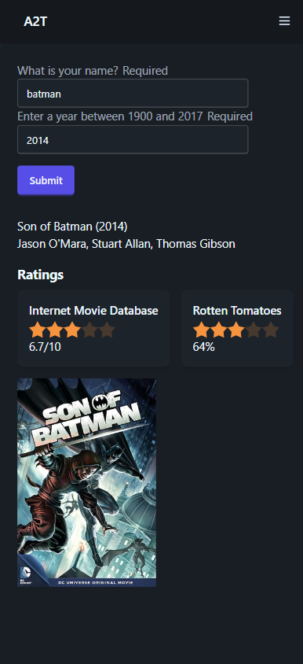

# Movie Search App

The **Movie Search App** is a responsive Angular application that allows users to search for movie details by providing their name and a specific year. The app fetches movie data from an API and displays information such as the movie title, actors, ratings, and poster. It includes form validation, a user-friendly interface, and is styled using **Tailwind CSS** and **DaisyUI** for enhanced UI components.

---

## Features

- **Responsive Design**: The app is fully responsive and works seamlessly on mobile, tablet, and desktop devices.
- **Form Validation**:
  - Name field: Required.
  - Year field: Must be a number between 1900 and 2017.
- **Movie Search**:
  - Fetches movie details based on the provided year.
  - Displays movie title, year, actors, ratings, and poster.
- **Ratings Display**:
  - Converts rating values (e.g., "8.5/10") into a 5-star visual representation using DaisyUI's rating component.
  - Supports multiple rating sources (e.g., IMDb, Rotten Tomatoes).
- **Error Handling**:
  - Displays error messages for invalid form inputs.
  - Shows a "No results found" message if no movie data is available for the provided year.
- **DaisyUI Components**:
  - Utilizes DaisyUI's prebuilt components like buttons, inputs, cards, and ratings for a polished and consistent UI.

---

## Technologies Used

- **Angular**: A TypeScript-based framework for building web applications.
- **Tailwind CSS**: A utility-first CSS framework for styling the app.
- **DaisyUI**: A plugin for Tailwind CSS that provides ready-to-use UI components.
- **Reactive Forms**: Used for form handling and validation.
- **Custom Directives**: A custom Angular directive (`*appMovieResults`) is used to display movie results.
- **API Integration**: Fetches movie data from an external API (e.g., OMDB API).

---

## Installation

1. **Clone the Repository**:
   ```bash
   git clone https://github.com/your-username/movie-search-app.git
   cd movie-search-app
   ```

2. **Install Dependencies**:
   ```bash
   npm install
   ```

3. **Install DaisyUI**:
   If DaisyUI is not already included in your project, install it using:

   ```bash
   npm install daisyui
   ```

   Then, add DaisyUI to your `tailwind.config.js`:

   ```javascript
   module.exports = {
     content: [
       './src/**/*.{html,ts}',
     ],
     theme: {
       extend: {},
     },
     plugins: [require('daisyui')],
   }
   ```

4. **Run the Application**:
   ```bash
   ng serve
   ```
   Open your browser and navigate to `http://localhost:4200`.

---

## Usage

1. **Enter Your Name**:
   Type your name in the "What is your name?" field.

2. **Enter a Year**:
   Provide a year between 1900 and 2017 in the "Enter a year between 1900 and 2017" field.

3. **Submit the Form**:
   Click the "Submit" button to search for movies released in the specified year.

4. **View Results**:
   - If a movie is found, its details (title, year, actors, ratings, and poster) will be displayed.
   - If no results are found, a "No results found" message will appear.

---

## Code Structure

- **Form Component**:
  - Handles user input and form validation.
  - Submits the form to trigger the movie search.

- **Movie Results Directive**:
  - Displays movie details using a custom Angular directive.
  - Converts rating values into a 5-star visual representation using DaisyUI's rating component.

- **Styling**:
  - Tailwind CSS is used for utility-based styling.
  - DaisyUI is used for prebuilt components like buttons, inputs, cards, and ratings.

---

## Example Screenshots


### Mobile View
(Mobile View Screenshot Placeholder)


---

## DaisyUI Components Used

- **Buttons**: DaisyUI's `btn` class for the submit button.
- **Inputs**: DaisyUI's `input` and `input-bordered` classes for form fields.
- **Cards**: DaisyUI's `card` and `bg-base-100` classes for displaying movie ratings.
- **Ratings**: DaisyUI's `rating` and `mask mask-star-2` classes for the star-based rating display.

---

## Contributing

Contributions are welcome! If you'd like to contribute to this project, please follow these steps:

1. Fork the repository.
2. Create a new branch for your feature or bugfix.
3. Commit your changes.
4. Push your branch and submit a pull request.

---

## License

This project is licensed under the MIT License. See the `LICENSE` file for details.

---

## Acknowledgments

- **Angular** for the framework.
- **Tailwind CSS** for the styling utilities.
- **DaisyUI** for the prebuilt UI components.
- **OMDB API** for providing movie data.

---

Enjoy using the Movie Search App! If you have any questions or feedback, feel free to open an issue or contact the maintainers. 🎬🍿
